class: middle right hide-count
background-image: url(06_imagenes/Identidad-gráfica/Portada-MCCI.png)
background-size: cover

```{r setup, include=FALSE}
options(htmltools.dir.version = FALSE)
knitr::opts_chunk$set(
  fig.width = 10, fig.height = 6, fig.retina = 2,
  warning = FALSE, message = FALSE
)
```
```{r js4shiny, echo=FALSE}
xaringanExtra::use_xaringan_extra(c("tile_view", "editable"))
js4shiny::html_setup(stylize = c("fonts", "variables", "code"))
```
```{r xaringan-webcam, include = FALSE}
# xaringanExtra::use_webcam()
```
```{r Paquetes-tema, include = FALSE}
#Paquetes
pacman::p_load(tidyverse, 
               ggthemes,
               reticulate,
               xaringanExtra)

# Guardar tema ----
tema_propio <- function(...) {
  theme_minimal() +
  theme(axis.line = element_line(size = 0.3),
        plot.title = element_text(hjust=0.5, 
                                  size = 14, face = "bold", 
                                  color = "grey20"),
        plot.subtitle = element_text(hjust=0.5,
                                     size = 12,
                                     color = "gray50"),
        plot.caption =  element_text(color = "gray50",
                                     size=10, 
                                     hjust=0),
        panel.grid = element_line(linetype = 2,
                                  size = 0.3,
                                  color = "gray90"),
        # panel.grid = element_blank(),
        panel.grid.minor = element_blank(),
        strip.background = element_rect(fill="gray95", 
                                        linetype="blank"),
        panel.border = element_rect(color = "gray80",
                                    fill=NA),
        rect = element_rect(fill = "transparent"),
        ...)
}
```
## **<span style='color:#e6e6e6'><p>Ejemplos prácticos de web scraping <br>y limpieza de datos</p></span>**

## <span style='color:#bfbfbf'> Javier Mtz</span>

---
layout: true

background-image: url(06_imagenes/Identidad-gráfica/Pagina-MCCI.png)
background-size: cover
## ¿Qué vamos a ver?
---


--
**Proceso de análisis** 


---

**Proceso de análisis** 


---

**Proceso de análisis** 


---
layout: false
class: middle center hide-count
background-image: url(06_imagenes/Identidad-gráfica/Portada-MCCI.png)
background-size: cover
# **<span style='color:#e6e6e6'><p>Análisis de las mañaneras</p></span>**

---
layout: true

background-image: url(06_imagenes/Identidad-gráfica/Pagina-MCCI.png)
background-size: cover
## **Análisis de las mañaneras**
---

### Objetivo:

* Analizar el discurso del Presidente frente a diferentes temas. 

---

### Identificación de fuentes de información

.pull-left[
* lopezobrador.org.mx
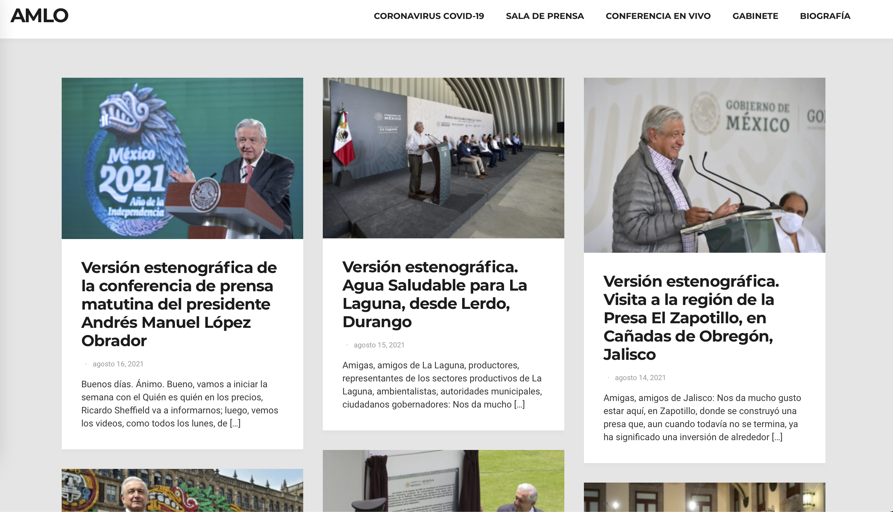
]

.pull-right[
* gob.mx/presidencia
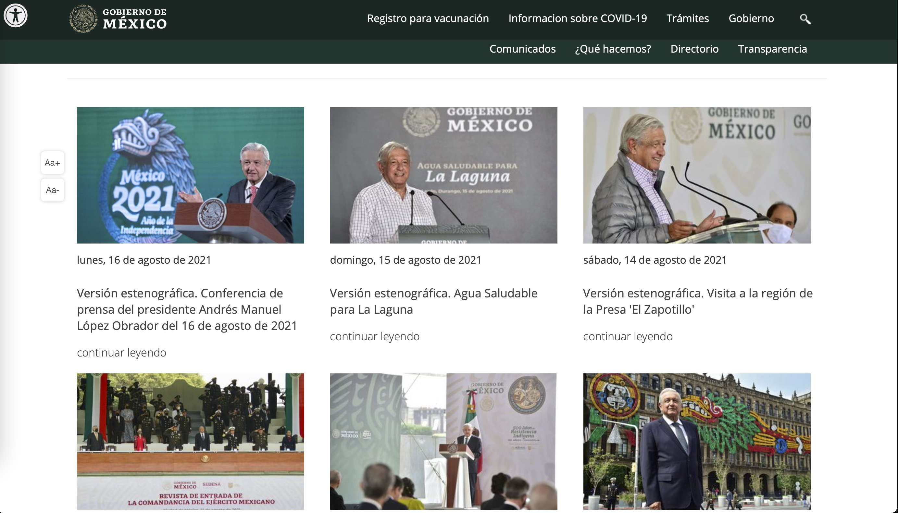
]

---

### ¿Qué queremos extraer de la página?

.pull-left[

]

.pull-right[
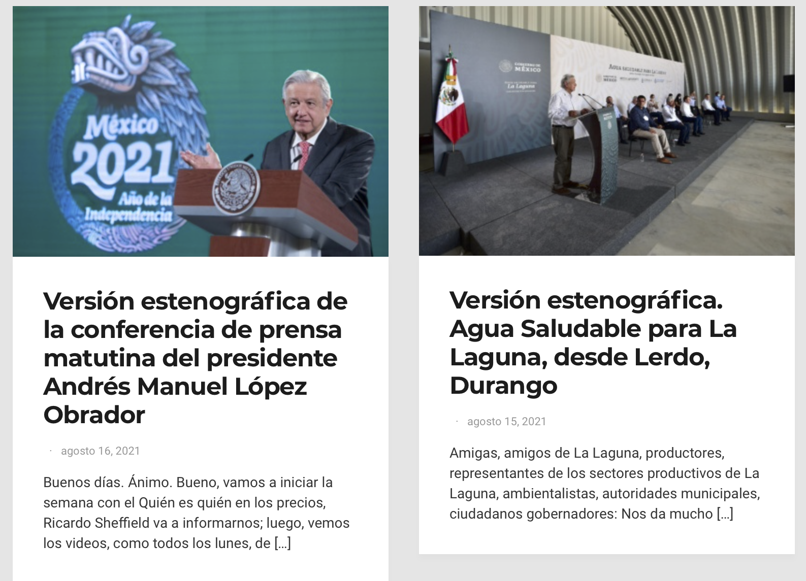
]

---

### ¿Qué queremos extraer de la página?

.pull-left[
* Título/evento
]

.pull-right[
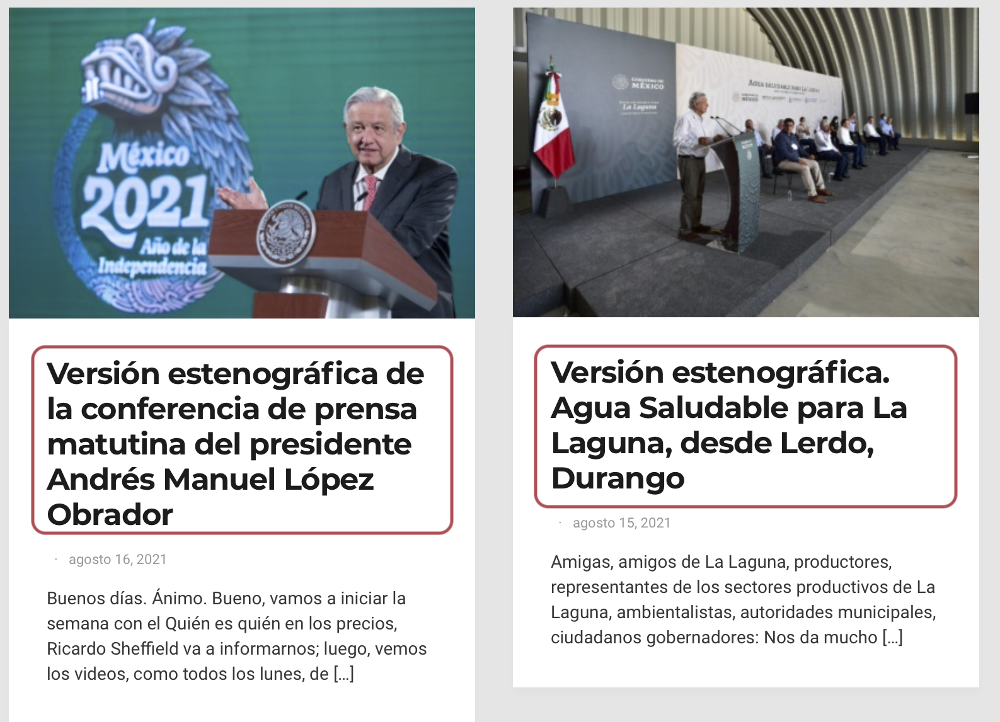
]

---

### ¿Qué queremos extraer de la página?

.pull-left[
* Título/evento


* Fecha del evento
]

.pull-right[
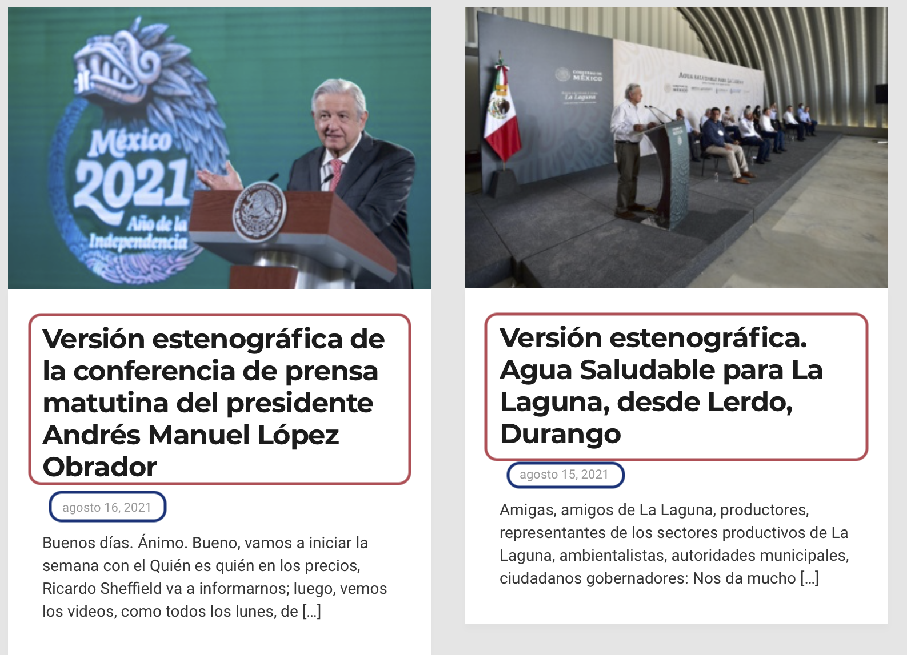
]

---

### ¿Qué queremos extraer de la página?

.pull-left[
* Título/evento


* Fecha del evento


* Url
]

.pull-right[
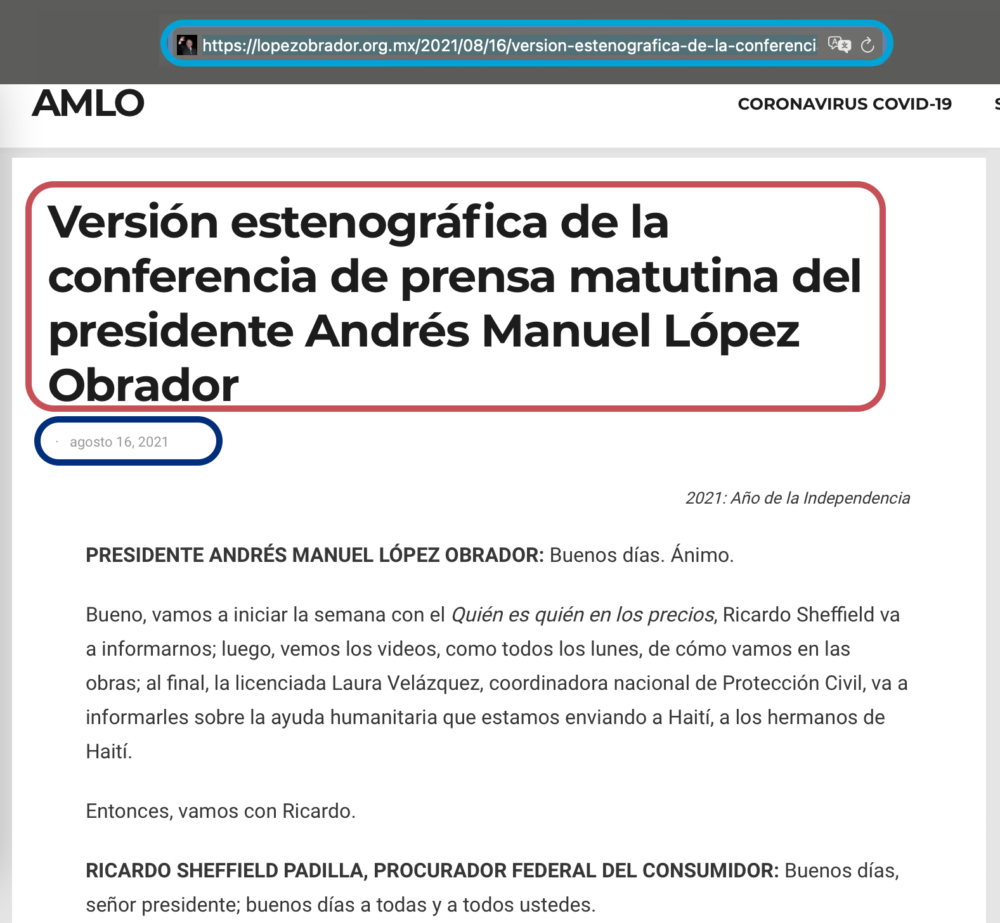
]

---

### ¿Qué queremos extraer de la página?

.pull-left[
* Título/evento


* Fecha del evento


* Url


* Cuerpo del texto
]

.pull-right[

]

---

### ¿Cómo extraemos los elementos?

--

#### 1. Crear un proceso para la extracción del título, fecha y url


--
#### 2. Repetir este proceso para cada página con información
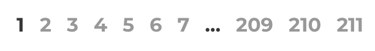


--
#### 3. Extracción del texto de cada publicación a partir de la url

---
layout: true

background-image: url(06_imagenes/Identidad-gráfica/Pagina-MCCI.png)
background-size: cover
### **1. Crear un proceso para la extracción del título, fecha y url**
---


--

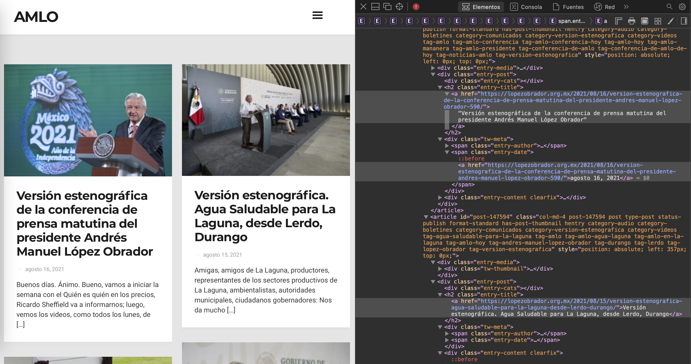

---

#### Paquetes a utilizar

--

.pull-left[
R
```{r eval=TRUE, include=TRUE}
pacman::p_load(tidyverse, # Manejo de dataframe
               rvest,     # Web scraping de páginas estáticas
               stringr)   # Manejo de texto
```
]


.pull-right[
Python
```{python eval=FALSE, include=TRUE}
import pandas # Manejo de dataframe
import requests # Web scraping de páginas estáticas
from bs4 import BeautifulSoup
import re     # Manejo de texto
# Otras librerías para análisis y manejo de texto
import nltk
import string 

```
]

---

#### Extraer información de página inicial

--

.pull-left[
R
```{r eval=TRUE, include=TRUE}
url <- "https://lopezobrador.org.mx/transcripciones/"

pagina <- html_session(url)

list_trans_evento <- pagina %>% 
  html_nodes("h2") %>% 
  html_text() 

list_trans_fecha <- pagina %>% 
  html_nodes("span.entry-date a") %>% 
  html_text() 

list_trans_link <- pagina %>% 
  html_nodes(".entry-title a") %>% 
  html_attr('href')
  
```
]


.pull-right[
Python
```{python eval=FALSE, include=TRUE}
page = requests.get("https://lopezobrador.org.mx/transcripciones/")

soup = BeautifulSoup(page.content, 'html.parser')

list_trans_evento = [x.text for x in soup.find_all('h2')]

list_trans_fecha = [x.text for x in soup.find_all(class_ ='entry-date')]

list_trans_link = [x.find_all("a")[0]["href"] for x in soup.find_all('h2', class_ ='entry-title')]
```
]

---

#### Dataframe único
--

.pull-left[
R
```{r eval=TRUE, include=TRUE}
total_eventos <- tibble(evento = list_trans_evento, 
                        fecha = list_trans_fecha,
                        link = list_trans_link)
```
]

.pull-right[
Python
```{python eval=FALSE, include=TRUE}
total_eventos = pd.DataFrame({'evento': list_trans_evento,
                             'fecha': list_trans_fecha,
                             'link': list_trans_link})
```
]

---

#### Dataframe único
--

```{r echo=FALSE}
knitr::kable(total_eventos) %>%
  kableExtra::kable_styling(font_size = 12)
```
---
layout: true

background-image: url(06_imagenes/Identidad-gráfica/Pagina-MCCI.png)
background-size: cover
### **2. Repetir este proceso para cada página con información**
---

#### Crear loop del proceso

--

```{r eval=TRUE, include=FALSE}
  for (pag in 2:3) {
    transcripciones <- html_session(paste0("https://lopezobrador.org.mx/transcripciones/",
                                        "page/", 
                                        as.character(pag),
                                        "/"))
    
list_trans_evento <- pagina %>% 
  html_nodes("h2") %>% 
  html_text() 

list_trans_fecha <- pagina %>% 
  html_nodes("span.entry-date a") %>% 
  html_text() 

list_trans_link <- pagina %>% 
  html_nodes(".entry-title a") %>% 
  html_attr('href')
    
total_eventos <- bind_rows(total_eventos, 
                           tibble(evento = list_trans_evento, 
                                  fecha = list_trans_fecha,
                                  link = list_trans_link)) 
  }  
```

R
```{r eval=FALSE, include=TRUE}
  for (pag in 2:211) {
    transcripciones <- html_session(paste0("https://lopezobrador.org.mx/transcripciones/",
                                        "page/", as.character(pag), "/"))

list_trans_evento <- pagina %>% 
  html_nodes("h2") %>% 
  html_text() 

list_trans_fecha <- pagina %>% 
  html_nodes("span.entry-date a") %>% 
  html_text() 

list_trans_link <- pagina %>% 
  html_nodes(".entry-title a") %>% 
  html_attr('href')
    
total_eventos <- bind_rows(total_eventos, 
                           tibble(evento = list_trans_evento, 
                                  fecha = list_trans_fecha,
                                  link = list_trans_link)) 
  }  
```

---

#### Crear loop del proceso

--

Python
```{python eval=FALSE, include=TRUE}
for x in range(1, 210):
    
    page = requests.get('https://lopezobrador.org.mx/transcripciones/page/{}/'.format(x))
    
    soup = BeautifulSoup(page.content, 'html.parser')
    
    list_trans_evento_loop = [x.text for x in soup.find_all('h2')]
    
    list_trans_fecha_loop = [x.text for x in soup.find_all(class_ ='entry-date')]
    
    list_trans_link_loop = [x.find_all("a")[0]["href"] for x in soup.find_all('h2', class_ ='entry-title')]
    
    total_eventos_loop = pd.DataFrame({'evento': list_trans_evento_loop,
                             'fecha': list_trans_fecha_loop,
                             'link': list_trans_link_loop})
    
    total_evetos = pd.concat([total_eventos_loop, total_evetos])
```


---
layout: true

background-image: url(06_imagenes/Identidad-gráfica/Pagina-MCCI.png)
background-size: cover
### **3. Extracción del texto de cada publicación a partir de la url**
---

--

.pull-left[
R
```{r eval=TRUE, include=TRUE}
texto_transcripciones <- map(total_eventos$link,
    function(x){html_session(x) %>% 
        html_nodes(".entry-content") %>% 
        html_text() })
```
]

.pull-right[
Python
```{python eval=FALSE, include=TRUE}
texto_transcripciones = []

for x in total_eventos["link"]:
    
    page = requests.get(x)
    
    soup = BeautifulSoup(page.content, 'html.parser')

    texto_transcripciones_loop = soup.find_all(class_ = "entry-content")[0].get_text()
    
    texto_transcripciones += [texto_transcripciones_loop]
```
]

---

Lista de transcripciones

--

```{r echo=FALSE}

paste0(substr(texto_transcripciones, 100,400), " [...]") %>% 
  head(6) %>% 
  knitr::kable() %>%
  kableExtra::kable_styling(font_size = 12)
```

--


Pero antes de unirlo con el dataframe, vamos a procesarlo. 

---
layout: true

background-image: url(06_imagenes/Identidad-gráfica/Pagina-MCCI.png)
background-size: cover
### **Limpieza y ordenar texto**
---

--

#### Eliminación de saltos, textos y dobles espacios inncesarios

.pull-left[
R
```{r eval=TRUE, include=TRUE}
num_transcrip <- 1
transcripcion <- texto_transcripciones[[num_transcrip]] %>% 
  str_replace_all("\n", " ") %>% 
  str_replace_all("\r", " ") %>% 
  str_replace_all("   ", " ") %>% 
  str_squish() %>% 
  str_remove_all("2021: Año de la Independencia |\\+\\+\\+\\+\\+") %>% 
  str_trim(side = "right") 

```
]

.pull-right[
Python
```{python eval=FALSE, include=TRUE}
num_transcrip = 0
transcripcion = texto_transcripciones[num_transcrip]
transcripcion = transcripcion.replace("\n", " ")
transcripcion = transcripcion.replace("\xa0", " ")
transcripcion = re.sub(' +', ' ', transcripcion)
transcripcion = transcripcion.replace("2021: Año de la Independencia ", "")
transcripcion = transcripcion.replace(r"\\+\\+\\+\\+\\+", "")
```
]

---

#### Eliminación de saltos, textos y dobles espacios inncesarios


```{r echo=FALSE}
transcripcion %>% 
  substr(1, 1000) %>% 
  knitr::kable() %>%
  kableExtra::kable_styling(font_size = 15)
```

---

--

#### **El problema:**

--

#### Estas transcripciones incluyen la participación de distintos actores.

--

#### ¿Qué hacer al respecto?

--

Estructurar estas participaciones.

---

#### Estructurar intervenciones

.pull-left[
R
```{r eval=TRUE, include=TRUE}

intervensor <- transcripcion %>% 
  str_extract_all("([:space:][:upper:]+)*([:space:][:upper:]+)(\\:)|([:space:][:upper:]+)*,([:space:][:upper:]+)*([:space:][:upper:]+)(\\:)") %>% 
                                         .[[1]] %>% 
                                         unique() %>% 
  str_trim(side = "both") %>% 
  .[order(nchar(.), .)]
  
```
]

.pull-right[
Python
```{python eval=FALSE, include=TRUE}
def sin_acento(x):
    output = x.replace('á','a').replace('é','e').replace('í','i').replace('ó','o').replace('ú','u')\
            .replace('Á','A').replace('É','E').replace('Í','I').replace('Ó','O').replace('Ú','U')
    return output
  
intervensor = sin_acento(transcripcion)
intervensor = re.findall("((\s[A-Z]+)*)(\:)|((\s[A-Z]+)*),((\s[A-Z]+)+)(\:)", 
intervensor)
intervensor = np.unique(intervensor)
intervensor = intervensor.strip()
intervensor = sorted(intervensor, key=len)
intervensor = [x for x in intervensor if x not in {'',':'}]
```
]

---

#### Estructurar intervenciones

```{r echo=FALSE}
intervensor %>% 
  knitr::kable() %>%
  kableExtra::kable_styling(font_size = 15)
```

---

#### Separación por intervención

R
```{r eval=TRUE, include=TRUE}

intervensor_text <- paste0("~~~", intervensor)

names(intervensor_text) <- intervensor
   
transcripcion_final <- transcripcion %>% 
  str_replace_all(intervensor_text) %>% 
  str_split(pattern = "~~~") %>% .[[1]] %>%
  as_tibble() %>% 
  rename(texto = value) %>% 
  mutate(orador = str_extract(texto, paste0(intervensor,
                                                 collapse = "|")),
         orador = str_remove(orador, "\\:"),
         orador = str_replace_all(orador,
                                 "ANDRÉS MANUEL LÓPEZ OBRADOR PRESIDENTE|PRESIDENTE ANDRÉS MANUEL LÓPEZ OBRADOR|ANDRÉS MANUEL LÓPEZ OBRADOR", "AMLO"),
         palabras_amlo = ifelse(str_detect(orador, "AMLO"),1,0), 
         texto = str_remove_all(texto, paste0(intervensor,
                                          collapse = "|")),
         texto = str_remove_all(texto, "PRESIDENTE"),
         texto = str_trim(texto, side = "both"),
         num = num_transcrip) 

```


---

#### Separación por intervención

Python
```{python eval=FALSE, include=TRUE}
intervensor_text = ["~~~"+x for x in intervensor]
transcripcion = sin_acento(transcripcion)

transcripcion_final = pd.DataFrame([transcripcion])[0].replace(intervensor,intervensor_text,regex=True)[0]
transcripcion_final = transcripcion_final.split("~~~")
transcripcion_final = pd.DataFrame({'texto': transcripcion_final})

intervensor_2 = [x+": " for x in intervensor]

transcripcion_final['orador'] = transcripcion_final['texto'].str.extract(r"((\s[A-Z]+)*)(\:)|((\s[A-Z]+)*),((\s[A-Z]+)+)(\:)")[0]
transcripcion_final['texto'] = transcripcion_final['texto'].replace(intervensor_2,"",regex=True)
transcripcion_final['num'] = num_transcrip
```

---

#### Separación por intervenciones 

```{r echo=FALSE}
transcripcion_final %>% 
  filter(!is.na(orador)) %>% 
  mutate(texto = substr(as.character(texto), 1, 100)) %>%
  head(8) %>%
  knitr::kable() %>%
  kableExtra::kable_styling(font_size = 12)
```

---

#### Realizar proceso de limpieza a los demás textos
--

**Funciones** + **Loops**
.pull-left[
R
```{r eval=FALSE, include=TRUE}

limpieza_conferencias <- function(num_texto) {
  # Estructurar intervenciones
  # Separación por intervenciones 
  # Integrar a un dataframe
}

texto_transcripciones_final <- map_df(1:length(texto_transcripciones),
                                      limpieza_conferencias) %>% 
  left_join(total_eventos %>% 
              mutate(num = row_number()), 
            by = "num")

```
]

.pull-right[
Python
```{python eval=FALSE, include=TRUE}
def limpieza_conferencias(num_texto):
  # Estructurar intervenciones; Separación por intervenciones ;Integrar a un dataframe
  
texto_transcripciones_final = []

for x in range(0, len(texto_transcripciones)):
    texto_transcripciones_final += limpieza_conferencias(x)
    
total_eventos["num"] = ['C'] = np.arange(len(total_eventos))
texto_transcripciones_final = pd.merge(texto_transcripciones_final,
    total_eventos,
    on = "num")

```
]


```{r eval=TRUE, include=FALSE}
limpieza_conferencias <- function(texto_num) {
  transcripcion <- texto_transcripciones[[texto_num]] %>% 
    str_replace_all("\n", " ") %>% 
    str_replace_all("\r", " ") %>% 
    str_replace_all("   ", " ") %>% 
    str_squish() %>% 
    str_remove_all("2021: Año de la Independencia |\\+\\+\\+\\+\\+") %>% 
    str_trim(side = "right") 
  
  intervensor <- transcripcion %>% 
    str_extract_all("([:space:][:upper:]+)*([:space:][:upper:]+)(\\:)|([:space:][:upper:]+)*,([:space:][:upper:]+)*([:space:][:upper:]+)(\\:)") %>% 
    .[[1]] %>% 
    unique() %>% 
    str_trim(side = "both") %>% 
    .[order(nchar(.), .)]
  
  if (identical(intervensor, character(0))) {
    
    transcripcion_final <- tibble(texto = transcripcion,
                                  orador = "AMLO",
                                  palabras_amlo = 1,
                                  num = texto_num)
    
      return(transcripcion_final)
    
    break
    
    
  }
  
  intervensor_text <- paste0("~~~", intervensor)
  
  names(intervensor_text) <- intervensor
  
  transcripcion_final <- transcripcion %>% 
    str_replace_all(intervensor_text) %>% 
    str_split(pattern = "~~~") %>% 
    .[[1]] %>%
    as_tibble() %>% 
    rename(texto = value) %>% 
    mutate(orador = str_extract(texto, paste0(intervensor,
                                              collapse = "|")),
           orador = str_remove(orador, "\\:"),
           orador = str_replace_all(orador,
                                    "ANDRÉS MANUEL LÓPEZ OBRADOR PRESIDENTE|PRESIDENTE ANDRÉS MANUEL LÓPEZ OBRADOR|ANDRÉS MANUEL LÓPEZ OBRADOR", "AMLO"),
           palabras_amlo = ifelse(str_detect(orador, "AMLO"),1,0),
           texto = str_remove_all(texto, paste0(intervensor,
                                                collapse = "|")),
           texto = str_remove_all(texto, "PRESIDENTE"),
           texto = str_trim(texto, side = "both"),
           num = texto_num) 
  
  return(transcripcion_final)
  
}

1:length(texto_transcripciones)

texto_transcripciones_final <- map_df(1:length(texto_transcripciones),
                                      limpieza_conferencias) %>% 
    left_join(total_eventos %>% 
              mutate(num = row_number()), 
            by = "num") %>% 
  filter(!is.na(orador))

```

---

#### Realizar proceso de limpieza a los demás textos

--

```{r echo=FALSE}
texto_transcripciones_final %>% 
    mutate(texto = substr(as.character(texto), 1, 100),
           evento = substr(as.character(evento), 1, 50),
           link = substr(as.character(link), 1, 50)) %>%
  head(8) %>% 
  knitr::kable() %>%
  kableExtra::kable_styling(font_size = 10)
```

---

layout: false
class: middle center hide-count
background-image: url(06_imagenes/Identidad-gráfica/Portada-MCCI.png)
background-size: cover
# **<span style='color:#e6e6e6'><p>Ejemplos de análisis</p></span>**

---

layout: true
background-image: url(06_imagenes/Identidad-gráfica/Pagina-MCCI.png)
background-size: cover
---

#### **<p>Catorce sexenios: los discursos de toma de posesión<br> de Cárdenas a López Obrador</p>**

##### Manuel Toral

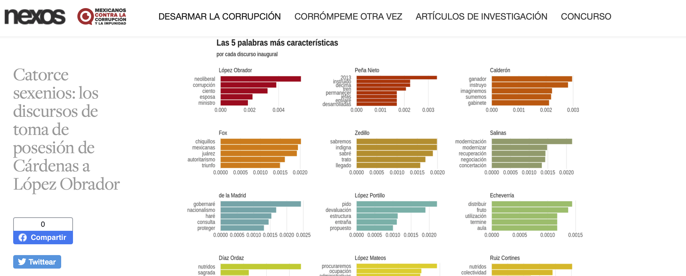

---

#### **<p>¿De qué habla el presidente cuando habla <br>de progreso social?</p>**

##### Katia Guzmán

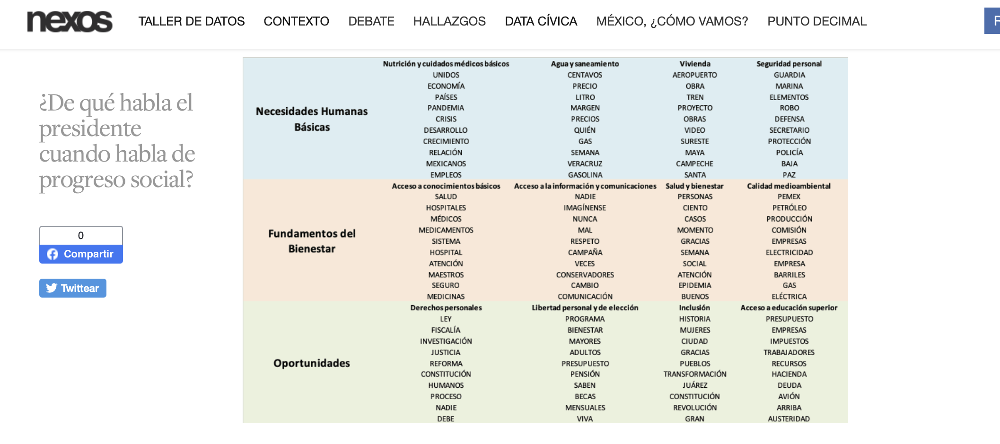

---

#### **<p>LOS TEMAS DEL PRESIDENTE EN LAS <br> CONFERENCIAS MATUTINAS</p>**

##### Humberto González

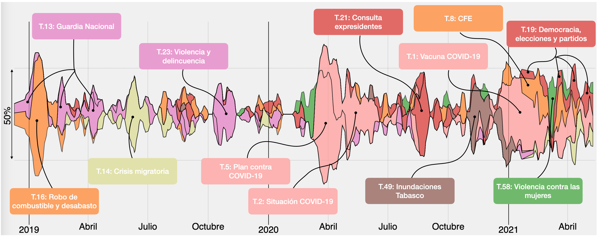
---

layout: false
class: middle center hide-count
background-image: url(06_imagenes/Identidad-gráfica/Portada-MCCI.png)
background-size: cover
# **<span style='color:#e6e6e6'><p>Posibles análisis</p></span>**

---

layout: true
background-image: url(06_imagenes/Identidad-gráfica/Pagina-MCCI.png)
background-size: cover
---

### **<p>Posibles análisis<p>**

* ¿Qué dice Claudia Seinbaum sobre la seguridad en la CdMx?
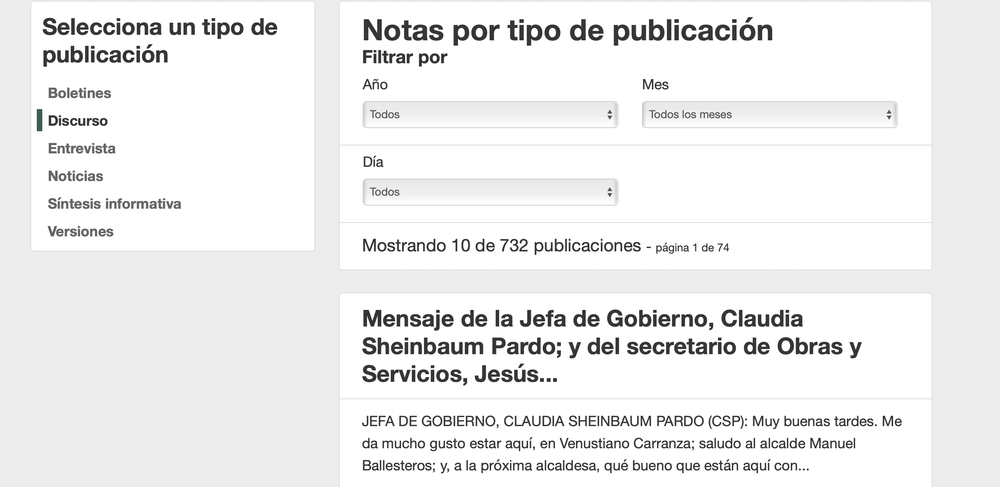

---

### **<p>Posibles análisis<p>**

* ¿Qué dice Silbano Aurioles sobre la seguridad en Michoacán?
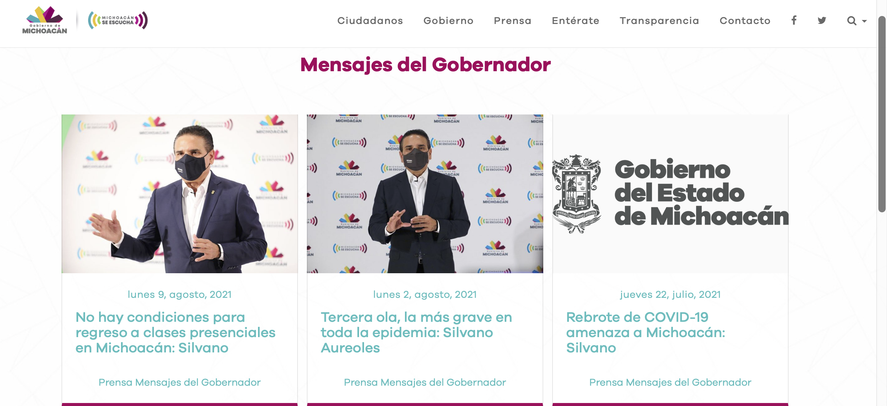

---

### **<p>Posibles análisis<p>**

* ¿Qué dice Francisco Domínguez sobre la seguridad en Querétaro?

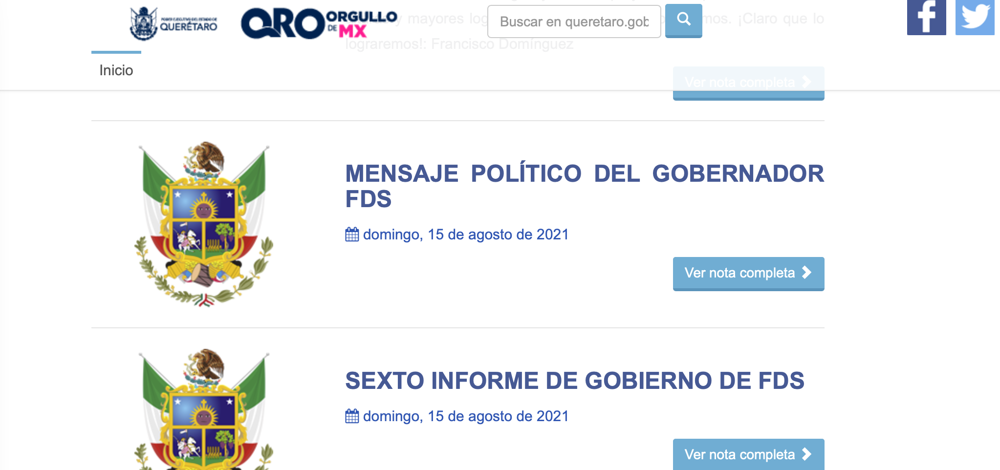

---

### **<p>Posibles análisis<p>**

* ¿Qué dijeron los senadores al respecto de la seguridad?
* ¿Qué ha discutido la comisión de Seguridad pública?

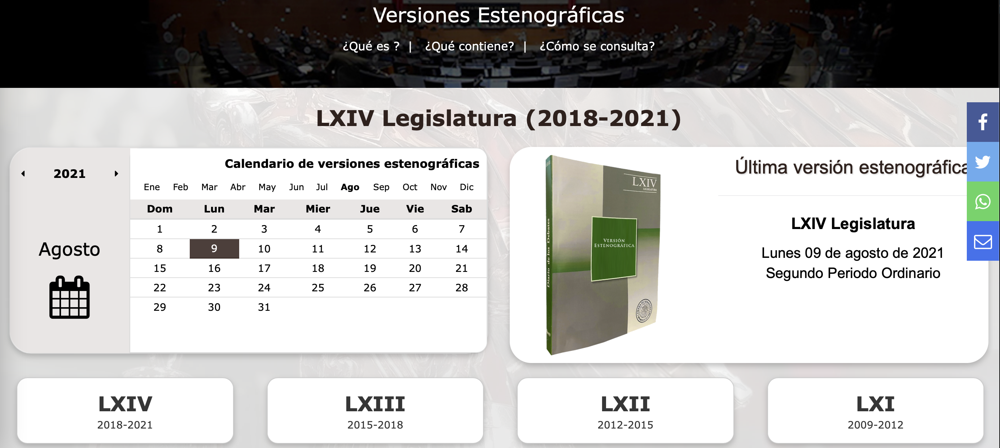


