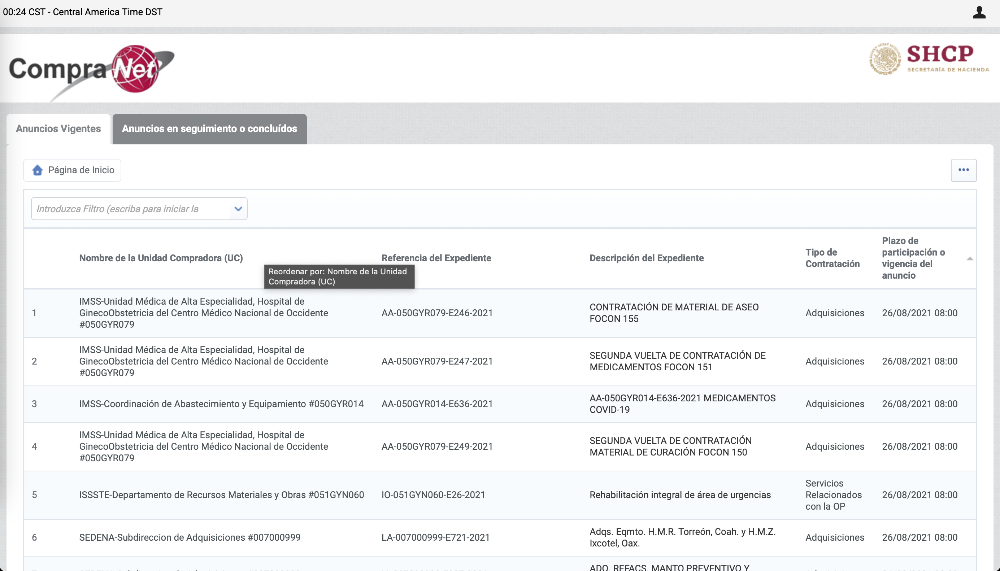
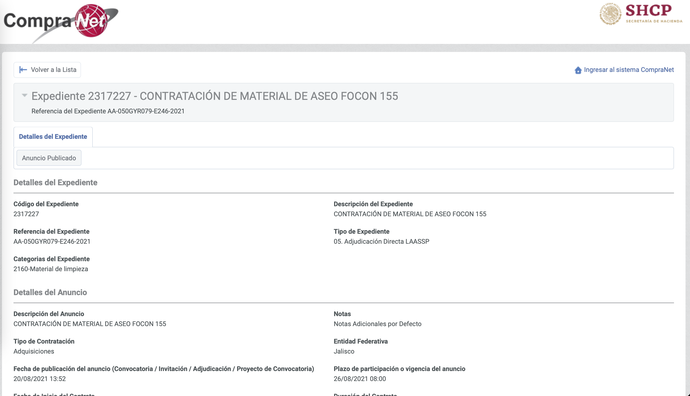
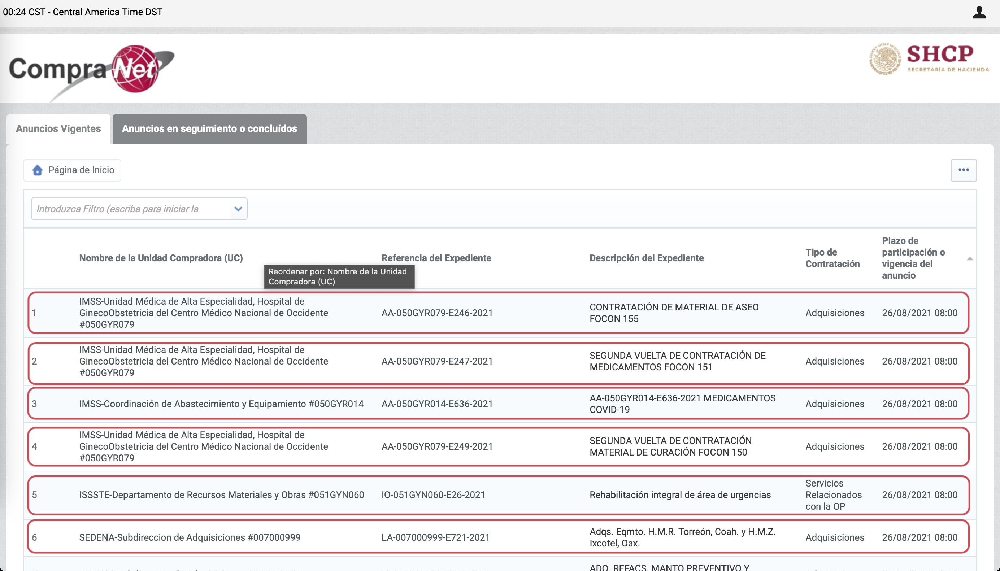
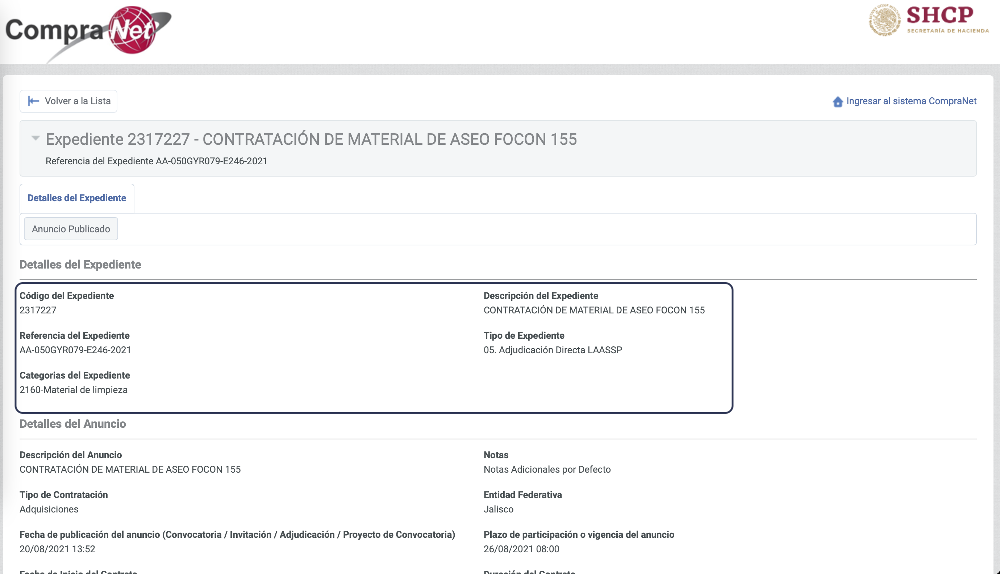
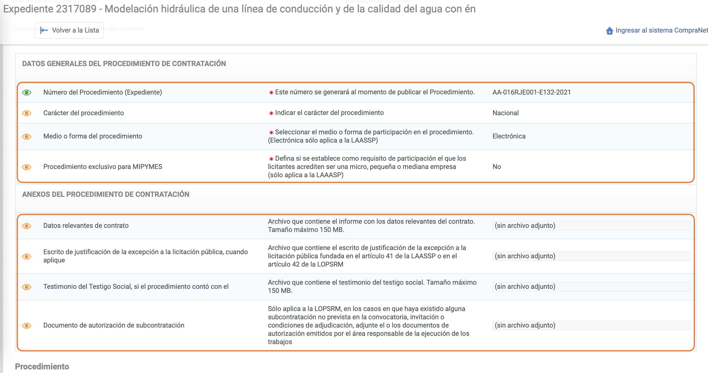
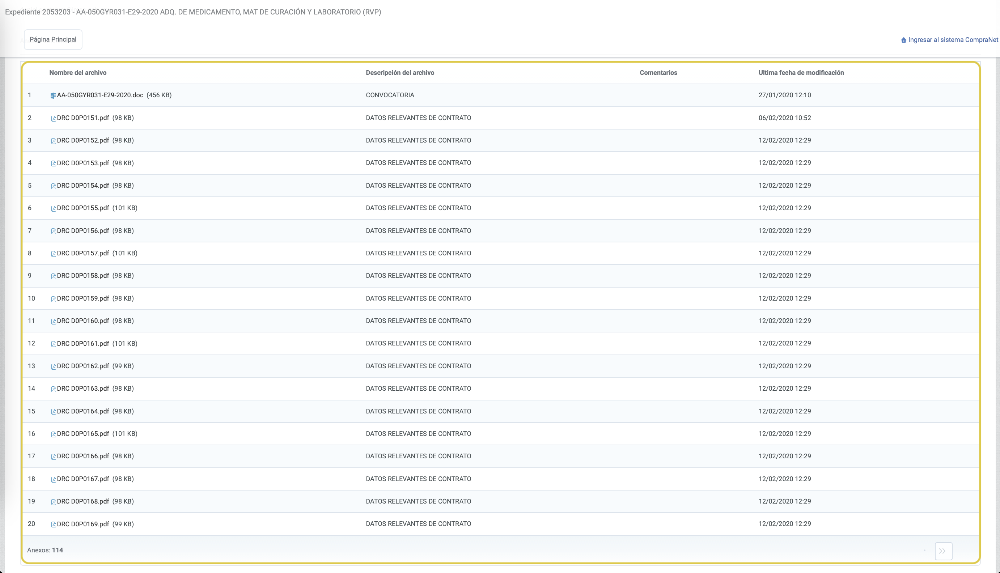
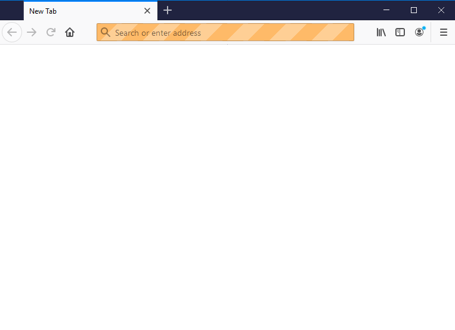

class: middle right hide-count
background-image: url(06_imagenes/Identidad-gráfica/Portada-MCCI.png)
background-size: cover

```{r setup, include=FALSE}
options(htmltools.dir.version = FALSE)
knitr::opts_chunk$set(
  fig.width = 10, fig.height = 6, fig.retina = 2,
  warning = FALSE, message = FALSE
)
```
```{r js4shiny, echo=FALSE}
xaringanExtra::use_xaringan_extra(c("tile_view", "editable"))
js4shiny::html_setup(stylize = c("fonts", "variables", "code"))
```
```{r xaringan-webcam, include = FALSE}
# xaringanExtra::use_webcam()
```
```{r Paquetes-tema, include = FALSE}
#Paquetes
pacman::p_load(tidyverse, 
               ggthemes,
               rvest,
               xaringanExtra)

# Guardar tema ----
tema_propio <- function(...) {
  theme_minimal() +
  theme(axis.line = element_line(size = 0.3),
        plot.title = element_text(hjust=0.5, 
                                  size = 14, face = "bold", 
                                  color = "grey20"),
        plot.subtitle = element_text(hjust=0.5,
                                     size = 12,
                                     color = "gray50"),
        plot.caption =  element_text(color = "gray50",
                                     size=10, 
                                     hjust=0),
        panel.grid = element_line(linetype = 2,
                                  size = 0.3,
                                  color = "gray90"),
        # panel.grid = element_blank(),
        panel.grid.minor = element_blank(),
        strip.background = element_rect(fill="gray95", 
                                        linetype="blank"),
        panel.border = element_rect(color = "gray80",
                                    fill=NA),
        rect = element_rect(fill = "transparent"),
        ...)
}
```
## **<span style='color:#e6e6e6'><p>Ejemplos prácticos de web scraping <br>dinámica y otros usos del menejo de texto</p></span>**

## <span style='color:#bfbfbf'> Javier Mtz</span>

---
layout: true

background-image: url(06_imagenes/Identidad-gráfica/Pagina-MCCI.png)
background-size: cover
## ¿Qué vamos a ver?
---


--
**Proceso de análisis** 


---

**Proceso de análisis** 


---

**Proceso de análisis** 


---

**Proceso de análisis** 


---
layout: false
class: middle center hide-count
background-image: url(06_imagenes/Identidad-gráfica/Portada-MCCI.png)
background-size: cover
# **<span style='color:#e6e6e6'><p>Análisis de documentos de CompraNet</p></span>**

---
layout: true

background-image: url(06_imagenes/Identidad-gráfica/Pagina-MCCI.png)
background-size: cover
## **Análisis de documentos de CompraNet**
---

### Objetivo:
--

* Ampliar la información disponible de contrataciones públicas. 

---

### Objetivo:

Yo intentando hacer un análisis con datos públicos:


---

### Objetivo:


* Ampliar la información disponible de contrataciones públicas. 


* Mapear información documentos e información disponible de CompraNet.
--


* Análisis de texto de documentos relevantes. 


---

### Identificación de fuentes de información

.pull-left[
* compranet.hacienda.gob.mx

]

.pull-right[
* Expedientes de CompraNet

]

---

### ¿Qué queremos extraer de la página?

.pull-left[

]

.pull-right[

]

---

### ¿Qué queremos extraer de la página?

.pull-left[
* Registros y links de expedientes
]

.pull-right[

]

---

### ¿Qué queremos extraer de la página?

.pull-left[
* Registros y links de expedientes


* Detalles del expediente
]

.pull-right[

]

---

### ¿Qué queremos extraer de la página?

.pull-left[
* Registros y links de expedientes


* Detalles del expediente


* Datos generales y anexos
]

.pull-right[

]

---

### ¿Qué queremos extraer de la página?

.pull-left[
* Registros y links de expedientes


* Detalles del expediente


* Datos generales y anexos


* Anexos adicionales
]

.pull-right[

]

---

### Dificultades:

--

#### 1. Extraer información de una página dinámica
--

#### 2. Establecer procedimiento de consulta


---

### Extraer información de una página dinámica
--


* A diferencia de las páginas estáticas, éstas reaccionan ante la información y acciones que realicemos.
--


* Estas páginas necesitan de nuestras _respuestas_ para funcionar. Por tanto, cada visitante puede ver diferente información.
--


* Muchas de estas páginas generan información posteriormente a que cargó. 


---

###  Extraer información de una página dinámica y procedimiento de consulta

#### ¿Qué pasa con CompraNet si tratamos de analizar una página como si fuera estática?
--

```{r, error=TRUE}
library(rvest)

read_html("https://compranet.hacienda.gob.mx/esop/toolkit/opportunity/ns/1795310/detail.si?isOnModification=false&_ncp=1629966548970.111568-2") %>% 
  html_table()

```
--

*HTTP 401:* indica que la petición ( _request_ ) no ha sido ejecutada porque carece de credenciales válidas de autenticación para el recurso solicitado.


---

###  Extraer información de una página dinámica y procedimiento de consulta

#### ¿Qué podemos hacer al respecto?
--

Usar `{RSelenium}` en tres pasos:

1. Crear el procedimiento de análisis de la página dinámica. 

2. Obtener el código fuente en R.

3. Seleccione la información exacta necesaria del código fuente.

---

###  Extraer información de una página dinámica y procedimiento de consulta

#### ¿Qué podemos hacer al respecto?

Usar `{RSelenium}` 

* Acceso a varios recursos.

* Selenium utiliza métodos y no sólo funciones.

* Permite interactuar con el navegador y los elementos de la página al mismo tiempo. 

---


###  ¿Cómo vamos a mapear la información de los expedientes?
--

#### 1. Preparar navegador
--

#### 2. Establecer procedimiento para consultar cada expediente
--

#### 3. Extraer la información del expediente seleccionado
--

#### 4. Repetir procedimiento para demas expedientes
--

#### 5. Descargar y procesar documentos

---

### 1. Preparar navegador
--


* [Prepara contenedor de Dockers para evitar problemas de Selenium](https://cran.r-project.org/web/packages/RSelenium/vignettes/docker.html)
--


* [Qué es y por qué usar Dockers](https://colinfay.me/docker-r-reproducibility/)
--


* [Seleccionar _drivers_ necesarios](https://levelup.gitconnected.com/web-scraping-with-r-part-2-dynamic-webpages-de620a161671)

---

### 1. Preparar navegador
--

Establecer perfil
```{r eval=FALSE, include=TRUE}
firefox_profile.me <- makeFirefoxProfile(list(browser.download.dir = normalizePath([carpeta_contratos]),
                                              browser.helperApps.neverAsk.openFile = [tipos de documentos],
                                              browser.helperApps.neverAsk.saveToDisk = [tipos de documentos]))
```


---

### 1. Preparar navegador
--

Crear y lanzar driver remoto

* `rsDriver` inicia un server y a partir de él podemos utilizar el navegador. 

* Cuidar que el _port_ coincida con el contenedor y no iniciar dos servers en el mismo. 

```{r eval=FALSE, include=TRUE}
driver <- rsDriver(browser = "firefox",
*                     port = 491L,
                      extraCapabilities = firefox_profile.me)

browser <- driver[["client"]]
server <- driver[["server"]]

```

---

### 1. Preparar navegador

.pull-left[
* Cómo resultado, se abrirá un navegador (este no será observable si lo creamos en un contenedor de Dockers)

* Se creará un objeto llamado _driver_.

]

.pull-right[

]


---

### 1. Preparar navegador

Para utilizar el navegador podemos aplicarle métodos. 

```{r eval=FALSE, include=TRUE}
browser$metodo()
```

Algunos métodos:
* `browser$navigate("https://pagina.com")`: sirve para abrir la página establecida.

* `browser$goBack()`: regresar a la página anterior.

* `browser$goForward()`: ir a la siguiente página.

---

### 1. Preparar navegador

Algunos métodos:

* `browser$refresh()`: volver a cargar página.

* `browser$CurrentUrl()`: obtener la url de la página.

* `browser$close()`: cerrar navegador.

* `browser$getPageSource()[[1]]`: obtener la página fuente.

  * Este método regresa una lista. El primer elemento es el xml de la página `[[1]]`

---

### 1. Preparar navegador

Algunos métodos:

* `browser$findElement(using = selector, value)`: encontrar ubicación de elemento.

  * El selector puede ser xpath, css, id, name, link text.
  
```{r eval=FALSE, include=TRUE}
icono <- browser$findElement(using = selector, value)
```

* `icono$clickElement()`: este método permite hacer click sobre el elemento previamente seleccionado. 

---

### 2. Establecer procedimiento para consultar expediente


```{r eval=FALSE, include=TRUE}
browser$navigate("https://compranet.hacienda.gob.mx/esop/guest/go/public/opportunity/past?locale=es_MX")

pagina_actual <- read_html(browser$getPageSource()[[1]]) 

tabla_expedientes <- pagina_actual %>% 
        html_table()

exp <- browser$findElement(using = "partial link text",
                             tabla_expedientes[1,4])
      
exp$clickElement()

```
---

### 2. Establecer procedimiento para consultar expediente

```{r eval=FALSE, include=TRUE}

tabla_expedientes 

```

```{r echo=FALSE}

tabla_expedientes <- read_html("https://compranet.hacienda.gob.mx/esop/guest/go/public/opportunity/past?locale=es_MX") %>% 
        html_table() %>% 
  .[[1]] 

tabla_expedientes %>% 
  head(4) %>% 
  knitr::kable() %>%
  kableExtra::kable_styling(font_size = 12)

```


---

### 3. Extraer la información del expediente seleccionado
--

```{r eval=FALSE, include=TRUE}
expediente_actual <- read_html(browser$getPageSource()[[1]]) 

tablas_exp <- expediente_actual %>% 
    html_table()
  
texto <- expediente_actual %>% 
    html_nodes(".form_container:nth-child(9) ul") %>% 
    html_text() %>% 
    str_remove_all("\t")

datos_exp <- texto %>% 
  str_split("\n") %>% 
  .[[1]] %>% 
  .[str_detect(., "")]

datos_exp <- tibble(categoria = datos_exp[!((1:length(datos_exp) %% 2) == 0)],
       informacion = datos_exp[(1:length(datos_exp) %% 2) == 0])

datos_exp
```


---

### 3. Extraer la información del expediente seleccionado

```{r echo=FALSE}

pagina <- try(read_html("https://compranet.hacienda.gob.mx/esop/guest/go/opportunity/detail?opportunityId=1795310"),
                silent = T)

tablas_exp <- pagina %>% 
    html_table()
  
texto <- pagina %>% 
    html_nodes(".form_container:nth-child(9) ul") %>% 
    html_text() %>% 
    str_remove_all("\t")

datos_exp <- texto %>% 
  str_split("\n") %>% 
  .[[1]] %>% 
  .[str_detect(., "")]

datos_exp <- tibble(categoria = datos_exp[!((1:length(datos_exp) %% 2) == 0)],
       informacion = datos_exp[(1:length(datos_exp) %% 2) == 0])

datos_exp %>% 
    head(5) %>% 
  knitr::kable() %>%
  kableExtra::kable_styling(font_size = 12)
```

---

### 3. Extraer la información del expediente seleccionado
--

```{r eval=FALSE, include=TRUE}
scrap_docs <- map_df(tablas_exp,
                       function(x){
         x %>% clean_names() %>% 
           {if(any(str_detect(names(.), "datos_generales_del_procedimiento"))){
             rename(., datos_generales = contains("datos_generales")) %>% 
               mutate(comienza_anexo = str_detect(str_to_upper(datos_generales1), "ANEXOS"),
                      comienza_anexo_num = cumsum(comienza_anexo)) %>% 
               filter(comienza_anexo_num > 0) %>% filter(row_number() > 2) %>% 
               transmute(categoria = datos_generales2,nombre_archivo = str_replace_all(datos_generales4, "\\)[^_]*", "\\)"))} else .} %>% 
           {if(any(str_detect(names(.), "nombre_del_archivo"))){
             rename(., nombre_archivo = contains("nombre"),
                    categoria = contains("descripcion")) %>% 
               select(nombre_archivo, categoria) } else .} %>% 
           add_column(., !!!c(nombre_archivo = NA_real_, categoria = NA_real_)[setdiff(names(c(nombre_archivo = NA_real_, categoria = NA_real_)), names(.))]) %>% 
           mutate(nombre_archivo = as.character(nombre_archivo), categoria = as.character(categoria)) %>% 
           select(nombre_archivo, categoria) %>% 
           filter(!is.na(nombre_archivo) & !is.na(categoria))
                       })

scrap_docs
```

---

### 3. Extraer la información del expediente seleccionado


```{r echo=FALSE}

scrap_docs <- map_df(tablas_exp,
                       function(x){
                         x %>% 
                           janitor::clean_names() %>% 
                           {if(any(str_detect(names(.), "datos_generales_del_procedimiento"))){
                             rename(.,
                                    datos_generales = contains("datos_generales")) %>% 
                               mutate(comienza_anexo = str_detect(str_to_upper(datos_generales1), 
                                                                  "ANEXOS"),
                                      comienza_anexo_num = cumsum(comienza_anexo)) %>% 
                               filter(comienza_anexo_num > 0) %>% 
                               filter(row_number() > 2) %>% 
                               transmute(categoria = datos_generales2,
                                         nombre_archivo = str_replace_all(datos_generales4,
                                                                          "\\)[^_]*", "\\)"))} else .} %>% 
                           {if(any(str_detect(names(.), "nombre_del_archivo"))){
                             rename(., nombre_archivo = contains("nombre"),
                                    categoria = contains("descripcion")) %>% 
                               select(nombre_archivo, categoria) } else .} %>% 
                           add_column(., !!!c(nombre_archivo = NA_real_, 
                                              categoria = NA_real_)[setdiff(names(c(nombre_archivo = NA_real_, 
                                                                                    categoria = NA_real_)), names(.))]) %>% 
                           mutate(nombre_archivo = as.character(nombre_archivo),
                                  categoria = as.character(categoria)) %>% 
                           select(nombre_archivo, categoria) %>% 
                           filter(!is.na(nombre_archivo) &
                                    !is.na(categoria))
                       })

scrap_docs %>% 
    head(5) %>% 
  knitr::kable() %>%
  kableExtra::kable_styling(font_size = 12)

```

---

#### 4. Repetir procedimiento para demas expedientes

```{r eval=FALSE, include=TRUE}
extraccion_expediente <- function(referencia_del_expediente) {
  # Entrar a la página del expediente
  # Extraer información del expediente
  # Crear dataframe de documentos
  # Cruzar información en un dataframe
}

for (ref_exp in tabla_expedientes$`Referencia del Expediente`) {
  extraccion_expediente(ref_exp)
}

new_page <- try(browser$findElement(using = "class", ".NavBtnForward"),
                        silent = T)

while (new_page != "try-error") {
  for (ref_exp in tabla_expedientes$`Referencia del Expediente`) {
  extraccion_expediente(ref_exp)
  }
  
  new_page <- try(browser$findElement(using = "class", ".NavBtnForward"),
                        silent = T)
  
}

```

---

#### 4. Repetir procedimiento para demas expedientes

```{r echo=FALSE}
docs_exp_total <- readxl::read_excel("01_datos_brutos/docs_exp_total.xlsx")


docs_exp_total %>% 
  select(-iteracion,
         -url) %>% 
    head(5) %>% 
  knitr::kable() %>%
  kableExtra::kable_styling(font_size = 12)

```

---

#### 5. Descargar y procesar documentos

```{r eval=FALSE, include=TRUE}
extraccion_expediente <- function(referencia_del_expediente) {
  # Entrar a la página del expediente
  # Extraer información del expediente
  # Crear dataframe de documentos
  # Cruzar información en un dataframe
  
  docs_descarga <- scrap_docs$nombre_archivo %>% 
    .[!str_detect(., "(sin archivo adjunto)")]
  
  for (doc in docs_descarga) {
    
    ub_doc <- try(driver$findElement(using = "partial link text", doc),
               silent = T)
    
    ub_doc$clickElement()
    
*   Sys.sleep(5)  
  }
}

pdftools::pdf_text(pdf = [Ubicacion])
```


---
layout: false
class: middle center hide-count
background-image: url(06_imagenes/Identidad-gráfica/Portada-MCCI.png)
background-size: cover

# **<span style='color:#e6e6e6'><p>Gracias</p></span>**

---
layout: false
class: middle center hide-count
background-image: url(06_imagenes/Identidad-gráfica/Portada-MCCI.png)
background-size: cover

# **<span style='color:#e6e6e6'><p>---</p></span>**

